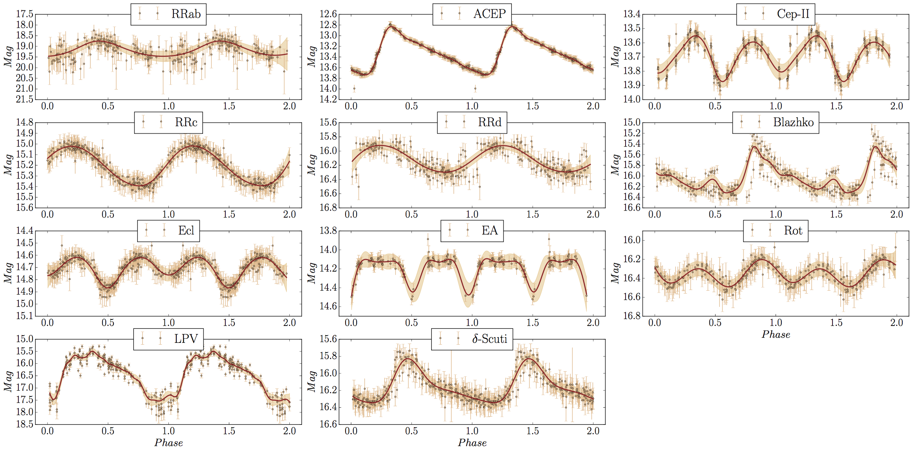

# Recurrence Analysis for Variable stars

Using the Catalina Real-Time surveys, 11 classes of variable stars are considered as shown below.

{: .center-block :}

# Can we convert time-series data to image plane?
A method known as Recurrence Analysis can be used and these images can further be used to perform classification of those variable stars using Convolutional Neural Network.
The plot below shows the recurrence plots for the 11 classes of variable stars. It can be observed that they are fairly different from each other on a visual perspective. 
The question is: Can we use computer vision technology, especially convolutional neural network to learn the features and classify them in 11 distict classes?

{: .center-block :}
